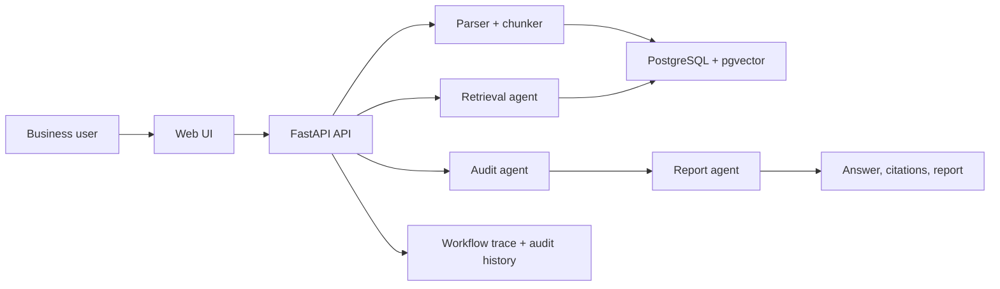

# Enterprise Knowledge Audit Agent

An auditable knowledge-base Agent for enterprise policies, contracts, sales playbooks, and compliance documents. It answers questions with source evidence, identifies policy conflicts, produces risk findings, and records workflow traces.


> The preview image can be regenerated with `python scripts/make_readme_screenshot.py`. The app runs without an API key by using local hybrid retrieval and evidence-grounded answers.

## Why This Project

- **Grounded answers**: every answer is derived from retrieved source chunks.
- **Hybrid retrieval**: combines lexical matching and local vector scoring.
- **Precise citations**: keeps page, paragraph, table, sheet, row, or line metadata.
- **Audit workflow**: separates retrieval, audit analysis, and report generation.
- **Evaluation**: includes 50 labeled cases with reproducible metrics.
- **Observability**: records prompts, tool calls, duration, token estimates, status, and failures.
- **Access control**: demo users only see their own uploaded knowledge base content.
- **Deployable**: includes FastAPI, PostgreSQL/pgvector migrations, Docker Compose, and tests.

## Current Baseline

| Metric | Result |
| --- | --- |
| Cases | 60 |
| Recall@1 | 96.7% |
| Recall@3 | 100.0% |
| Citation accuracy | 96.7% |
| Answer quality pass rate | 100.0% |
| Risk type accuracy | 90.0% |
| Conflict accuracy | 100.0% |
| Evidence binding accuracy | 100.0% |
| Review trigger accuracy | 100.0% |

Detailed report: [docs/evaluation-report.md](docs/evaluation-report.md)

## Features

| Capability | Implementation |
| --- | --- |
| Upload and parsing | `.txt`, text-based PDF, scanned PDF OCR, `.docx`, `.xlsx`, HTML URL ingestion |
| Chunking | Source-aware chunks with location metadata |
| Retrieval | Keyword score + local vector cosine score; PostgreSQL path supports pgvector |
| Citations | Title, source path, excerpt, score, and location label |
| Audit findings | Sensitive export risk, incident response, and legacy-policy conflicts |
| Optional LLM synthesis | OpenAI-compatible Chat endpoint with strict JSON validation and rule-based fallback |
| Report export | JSON, Markdown, and Unicode-capable PDF |
| Audit history | Workflow traces persisted in PostgreSQL when Docker stack is used |
| Permissions | JWT login with `X-User-Id` demo fallback |
| Object storage | MinIO bucket for uploaded source files, with local disk fallback |
| Evaluation | 60 cases, risk metrics, JSON results, Markdown report, and UI baseline panel |

## Run Locally

Requires Python 3.9+.

```bash
python -m venv .venv
.venv\Scripts\activate
python -m pip install -r requirements.txt
uvicorn app.main:app --reload
```

Open `http://127.0.0.1:8000`.

For direct host-side PostgreSQL or Alembic work, install the optional database dependencies:

```bash
python -m pip install -r requirements-db.txt
```

### Model Provider Modes

The embedding provider and chat provider are configured separately. The default
`.env` setting is `MODEL_PROVIDER=local-hf`. It downloads the
open-source `BAAI/bge-small-zh-v1.5` embedding model and
`BAAI/bge-reranker-base` reranker into `data/models` on first use, then runs
locally without an API key. This is the recommended mode for Chinese
enterprise-document retrieval. Use `MODEL_PROVIDER=local` only for the
deterministic, dependency-free test fallback.

For a host-side Windows run, install the CPU runtime first, then the local
model dependency:

```powershell
.\.venv\Scripts\python.exe -m pip install torch==2.5.1+cpu --index-url https://download.pytorch.org/whl/cpu
.\.venv\Scripts\python.exe -m pip install -r requirements-local-models.txt
```

Docker performs the same CPU-only installation during `docker compose build`.
After the image is built, download and cache the model explicitly with:

```bash
docker compose run --rm app python scripts/download_local_model.py
```

To use a local chat LLM with Ollama, keep local embeddings enabled and turn on
the chat provider only:

```powershell
ollama pull qwen2.5:7b-instruct
```

```env
MODEL_PROVIDER=local-hf
CHAT_PROVIDER=openai-compatible
CHAT_OPENAI_BASE_URL=http://host.docker.internal:11434/v1
CHAT_OPENAI_API_KEY=ollama
CHAT_OPENAI_MODEL=qwen2.5:7b-instruct
```

For LM Studio, start the local OpenAI-compatible server and use:

```env
MODEL_PROVIDER=local-hf
CHAT_PROVIDER=openai-compatible
CHAT_OPENAI_BASE_URL=http://host.docker.internal:1234/v1
CHAT_OPENAI_API_KEY=lm-studio
CHAT_OPENAI_MODEL=<loaded-model-id>
```

To use DeepSeek for remote chat synthesis, keep local embeddings enabled and
set only the chat provider:

```env
MODEL_PROVIDER=local-hf
CHAT_PROVIDER=openai-compatible
CHAT_OPENAI_BASE_URL=https://api.deepseek.com
CHAT_OPENAI_API_KEY=your_deepseek_api_key
CHAT_OPENAI_MODEL=deepseek-chat
```

`host.docker.internal` lets the Docker container reach Ollama or LM Studio
running on the Windows host. If the chat provider is unavailable or returns
invalid JSON, the workflow records the failure in the trace and falls back to
the local evidence-grounded answer.

To use a remote OpenAI-compatible embedding provider, update `.env` without
committing the key:

```env
MODEL_PROVIDER=openai-compatible
OPENAI_API_KEY=your_api_key
OPENAI_BASE_URL=https://api.openai.com/v1
OPENAI_EMBEDDING_MODEL=text-embedding-3-small
OPENAI_EMBEDDING_DIMENSIONS=512
```

`GET /api/model-config` shows active embedding and chat provider details but
never returns API keys. In `MODEL_PROVIDER=openai-compatible` mode, document
chunks and search queries use the provider's `/embeddings` endpoint. The current
database schema uses `vector(512)`, so `OPENAI_EMBEDDING_DIMENSIONS` must remain
`512`. In `CHAT_PROVIDER=openai-compatible` mode, the report agent calls the
chat provider's `/chat/completions` endpoint with
`response_format={"type":"json_object"}`. The returned JSON must include
`answer` and `citations`.

When switching an existing PostgreSQL database from the old 64-dimensional
development vectors, run `alembic upgrade head`. The migration recreates the
vector column and the application backfills embeddings from stored chunk text.

## Run With Docker

```bash
copy .env.example .env
docker compose up --build
```

Docker Compose starts the app, PostgreSQL with pgvector, and MinIO. Uploaded documents and workflow traces are persisted in PostgreSQL when `DATABASE_URL` is configured. The app image includes Poppler and Tesseract so scanned PDFs can fall back to OCR when no embedded text layer is found.

The Compose stack also starts MinIO:

- API endpoint inside Docker: `minio:9000`
- Console: `http://127.0.0.1:9001`
- Default account: `minioadmin / minioadmin`
- Upload bucket: `audit-documents`

When `MINIO_ENDPOINT` is configured, uploaded source files are stored as
`minio://audit-documents/uploads/<document-id>/<filename>`. Without MinIO
settings, the app falls back to `data/runtime/uploads`.

## Test And Evaluate

```bash
pytest
python scripts/run_evaluation.py
```

The evaluation script writes:

- `data/evaluation_results.json`
- `docs/evaluation-report.md`

## Reset Demo Data

Before a live demo, clear demo audit history, remove persisted uploaded
documents owned by `local-demo`, and import the curated sample documents from
`data/test_uploads`:

```bash
docker compose exec app python scripts/reset_demo_data.py --all
```

The command above is a dry run. To actually modify PostgreSQL and seed MinIO,
add `--apply`:

```bash
docker compose exec app python scripts/reset_demo_data.py --all --apply
```

Useful narrower variants:

```bash
docker compose exec app python scripts/reset_demo_data.py --clear-audit --apply
docker compose exec app python scripts/reset_demo_data.py --clear-all-documents --seed-documents --apply
docker compose exec app python scripts/reset_demo_data.py --clear-documents --seed-documents --apply
```

The reset script keeps the built-in read-only seed documents, clears demo
workflow history for `local-demo`, `demo-alice`, and `demo-bob`, and reseeds the
curated upload documents for `local-demo`. Use `--clear-documents` instead of
`--clear-all-documents` when you only want to replace the curated demo uploads
and keep other manually uploaded files.

The README preview image can be regenerated with:

```bash
python scripts/make_readme_screenshot.py
```

## API Examples

Ask a question:

```bash
TOKEN=$(curl -s -X POST http://127.0.0.1:8000/api/auth/login \
  -H "Content-Type: application/json" \
  -d "{\"username\":\"alice\",\"password\":\"alice123456\"}" | python -c "import json,sys; print(json.load(sys.stdin)['access_token'])")

curl -X POST http://127.0.0.1:8000/api/ask ^
  -H "Content-Type: application/json" ^
  -H "Authorization: Bearer $TOKEN" ^
  -d "{\"question\":\"Can the legacy sales tool directly download the full customer list?\"}"
```

Upload a document:

```http
POST /api/documents/upload
```

Multipart fields:

- `title`: document title
- `file`: `.txt`, text-based `.pdf`, `.docx`, or `.xlsx`

PDF parsing first uses the embedded text layer. If no text is found, Docker builds use Poppler + Tesseract OCR (`chi_sim+eng`) to extract scanned pages.

Ingest a web page:

```http
POST /api/documents/ingest-url
```

JSON body:

- `title`: document title
- `url`: `http` or `https` HTML page

The page is fetched, visible HTML text is parsed into paragraph-level sections, and the resulting chunks are indexed like uploaded files.

## Architecture

See [docs/architecture.md](docs/architecture.md).



## Demo Script

1. Start the app with Docker Compose.
2. Open `http://127.0.0.1:8000`.
3. Ask: `Can the legacy sales tool directly download the full customer list?`
4. Show the grounded answer, citations, and risk findings.
5. Switch between Alice and Bob to demonstrate knowledge-base isolation.
6. Upload one PDF, DOCX, and XLSX sample from `data/sample_uploads`.
7. Export the report as Markdown and PDF.
8. Run `python scripts/run_evaluation.py` and open `docs/evaluation-report.md`.

## Learning Notes

- [Lesson 01: FastAPI setup](docs/lesson-01-setup.md)
- [Lesson 02: Upload API](docs/lesson-02-upload.md)
- [Lesson 03: PDF, Word, and Excel parsing](docs/lesson-03-parsers.md)
- [Lesson 04: Chunked citations](docs/lesson-04-chunked-citations.md)
- [Lesson 05: Database schema](docs/lesson-05-database-schema.md)
- [Lesson 06: Vector search](docs/lesson-06-vector-search.md)
- [Lesson 07: Workflow report](docs/lesson-07-workflow-report.md)
- [Lesson 08: Report export](docs/lesson-08-report-export.md)
- [Lesson 09: Permission schema](docs/lesson-09-permission-schema.md)
- [Lesson 10: Auth isolation](docs/lesson-10-auth-isolation.md)
- [Lesson 11: User switcher](docs/lesson-11-user-switcher.md)
- [Lesson 12: Observability](docs/lesson-12-observability.md)
- [Lesson 13: Trace persistence](docs/lesson-13-trace-persistence.md)
- [Lesson 14: Audit history](docs/lesson-14-audit-history.md)
- [Lesson 15: Evaluation](docs/lesson-15-evaluation.md)

## Roadmap

- Replace local scoring with production embeddings plus pgvector reranking.
- Add production-grade OCR preprocessing and page image quality diagnostics.
- Add LLM synthesis with strict JSON schema validation.
- Add LLM-as-judge and human-labeled citation-span evaluation.
- Add a recorded demo video and real browser screenshots.
