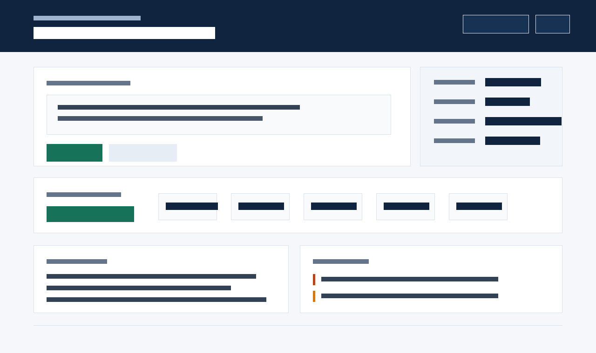
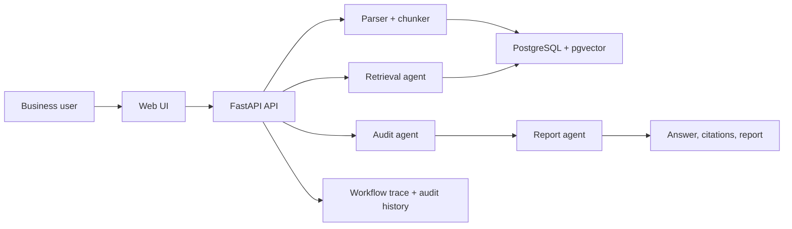

# Enterprise Knowledge Audit Agent

An auditable knowledge-base Agent for enterprise policies, contracts, sales playbooks, and compliance documents. It answers questions with source evidence, identifies policy conflicts, produces risk findings, and records workflow traces.



> The preview image can be regenerated with `python scripts/make_readme_screenshot.py`. The app runs without an API key by using local hybrid retrieval and evidence-grounded answers.

## Why This Project

- **Grounded answers**: every answer is derived from retrieved source chunks.
- **Hybrid retrieval**: combines lexical matching and local vector scoring.
- **Precise citations**: keeps page, paragraph, table, sheet, row, or line metadata.
- **Audit workflow**: separates retrieval, audit analysis, and report generation.
- **Evaluation**: includes 50 labeled cases with reproducible metrics.
- **Observability**: records prompts, tool calls, duration, token estimates, status, and failures.
- **Access control**: demo users only see their own uploaded knowledge base content.
- **Deployable**: includes FastAPI, PostgreSQL/pgvector migrations, Docker Compose, and tests.

## Current Baseline

| Metric | Result |
| --- | --- |
| Cases | 50 |
| Recall@1 | 98.0% |
| Recall@3 | 100.0% |
| Citation accuracy | 98.0% |
| Answer quality pass rate | 100.0% |

Detailed report: [docs/evaluation-report.md](docs/evaluation-report.md)

## Features

| Capability | Implementation |
| --- | --- |
| Upload and parsing | `.txt`, text-based PDF, `.docx`, `.xlsx` |
| Chunking | Source-aware chunks with location metadata |
| Retrieval | Keyword score + local vector cosine score; PostgreSQL path supports pgvector |
| Citations | Title, source path, excerpt, score, and location label |
| Audit findings | Sensitive export risk, incident response, and legacy-policy conflicts |
| Report export | JSON, Markdown, and Unicode-capable PDF |
| Audit history | Workflow traces persisted in PostgreSQL when Docker stack is used |
| Permissions | `X-User-Id` scoped document visibility |
| Evaluation | 50 cases, JSON results, Markdown report, and UI baseline panel |

## Run Locally

Requires Python 3.9+.

```bash
python -m venv .venv
.venv\Scripts\activate
python -m pip install -r requirements.txt
uvicorn app.main:app --reload
```

Open `http://127.0.0.1:8000`.

For direct host-side PostgreSQL or Alembic work, install the optional database dependencies:

```bash
python -m pip install -r requirements-db.txt
```

## Run With Docker

```bash
copy .env.example .env
docker compose up --build
```

Docker Compose starts the app and PostgreSQL with pgvector enabled. Uploaded documents and workflow traces are persisted in PostgreSQL when `DATABASE_URL` is configured.

## Test And Evaluate

```bash
pytest
python scripts/run_evaluation.py
```

The evaluation script writes:

- `data/evaluation_results.json`
- `docs/evaluation-report.md`

The README preview image can be regenerated with:

```bash
python scripts/make_readme_screenshot.py
```

## API Examples

Ask a question:

```bash
curl -X POST http://127.0.0.1:8000/api/ask ^
  -H "Content-Type: application/json" ^
  -H "X-User-Id: demo-alice" ^
  -d "{\"question\":\"Can the legacy sales tool directly download the full customer list?\"}"
```

Upload a document:

```http
POST /api/documents/upload
```

Multipart fields:

- `title`: document title
- `file`: `.txt`, text-based `.pdf`, `.docx`, or `.xlsx`

PDF support currently targets files with an embedded text layer. Scanned PDFs should go through OCR before upload.

## Architecture

See [docs/architecture.md](docs/architecture.md).



## Demo Script

1. Start the app with Docker Compose.
2. Open `http://127.0.0.1:8000`.
3. Ask: `Can the legacy sales tool directly download the full customer list?`
4. Show the grounded answer, citations, and risk findings.
5. Switch between Alice and Bob to demonstrate knowledge-base isolation.
6. Upload one PDF, DOCX, and XLSX sample from `data/sample_uploads`.
7. Export the report as Markdown and PDF.
8. Run `python scripts/run_evaluation.py` and open `docs/evaluation-report.md`.

## Learning Notes

- [Lesson 01: FastAPI setup](docs/lesson-01-setup.md)
- [Lesson 02: Upload API](docs/lesson-02-upload.md)
- [Lesson 03: PDF, Word, and Excel parsing](docs/lesson-03-parsers.md)
- [Lesson 04: Chunked citations](docs/lesson-04-chunked-citations.md)
- [Lesson 05: Database schema](docs/lesson-05-database-schema.md)
- [Lesson 06: Vector search](docs/lesson-06-vector-search.md)
- [Lesson 07: Workflow report](docs/lesson-07-workflow-report.md)
- [Lesson 08: Report export](docs/lesson-08-report-export.md)
- [Lesson 09: Permission schema](docs/lesson-09-permission-schema.md)
- [Lesson 10: Auth isolation](docs/lesson-10-auth-isolation.md)
- [Lesson 11: User switcher](docs/lesson-11-user-switcher.md)
- [Lesson 12: Observability](docs/lesson-12-observability.md)
- [Lesson 13: Trace persistence](docs/lesson-13-trace-persistence.md)
- [Lesson 14: Audit history](docs/lesson-14-audit-history.md)
- [Lesson 15: Evaluation](docs/lesson-15-evaluation.md)

## Roadmap

- Replace local scoring with production embeddings plus pgvector reranking.
- Add HTML ingestion and OCR for scanned PDFs.
- Add LLM synthesis with strict JSON schema validation.
- Add LLM-as-judge and human-labeled citation-span evaluation.
- Add a recorded demo video and real browser screenshots.
