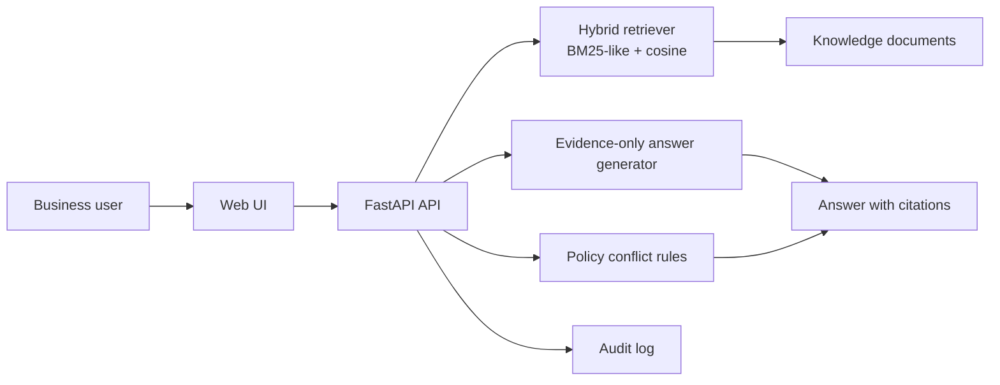

# Architecture

## Request flow

1. The user submits a question in the web UI.
2. The API retrieves the highest-scoring knowledge documents.
3. The answer generator only selects sentences from retrieved evidence.
4. The audit rules detect sensitive data export, incident response, and legacy-policy conflicts.
5. The UI renders the answer, source excerpts, and risk findings.
