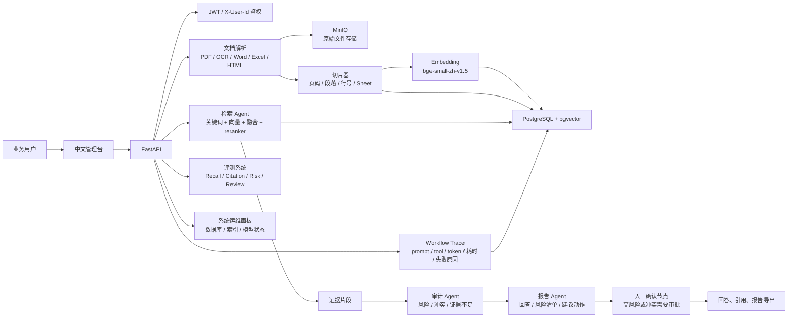

# 架构说明

本项目的核心链路是：文档入库、混合检索、多 Agent 审计、结构化报告、人工确认、评测与可观测。



## 文档入库流程

1. 用户上传 `.txt`、`.pdf`、`.docx`、`.xlsx`，或提交网页 URL。
2. 原始文件写入 MinIO；如果 MinIO 不可用，则降级写入本地运行目录。
3. 解析器提取文本，并尽量保留来源位置：
   - PDF：页码。
   - 扫描 PDF：Tesseract OCR。
   - Word：段落。
   - Excel：Sheet 和 Row。
   - HTML：段落。
4. 切片器生成带来源位置的 chunk。
5. 上传阶段生成 embedding，并写入 `document_chunks.embedding`。
6. 文档元数据、全文、切片和向量统一写入 PostgreSQL。

## 检索流程

提问时会执行两路检索：

1. 关键词检索：适合命中明确制度名、风险词、审批词。
2. 向量检索：适合语义相近但表达不同的问题。
3. 融合排序：合并关键词分数和向量相似度。
4. Reranker：使用本地 `BAAI/bge-reranker-base` 对候选证据重排。
5. 返回 TopK 证据，并保留引用来源。

没有证据时，系统不会直接编造答案，而是返回“没有可检索证据”。

## 多 Agent 工作流

当前 LangGraph 工作流由四个节点组成：

| 节点 | 职责 |
| --- | --- |
| 检索 Agent | 调用混合检索，返回证据和候选排序过程 |
| 审计 Agent | 基于规则识别风险、冲突和证据不足 |
| 报告 Agent | 生成带引用的回答、风险清单和建议动作 |
| 人工确认节点 | 高风险、冲突类结论进入人工审批 |

如果配置了 DeepSeek / Ollama / LM Studio 等 OpenAI-compatible Chat API，报告 Agent 会调用远程或本地 LLM 做归纳表达；如果调用失败，会记录失败原因并使用规则 fallback。

## 权限模型

项目提供演示级权限模型：

- `users`：用户。
- `knowledge_bases`：知识库。
- `knowledge_base_members`：用户和知识库的角色关系。
- `document_permissions`：文档级 ACL，配置后可限制单文档只对指定用户可见。
- `owner/editor/viewer`：角色分级。

上传、文档列表、检索、导出、系统诊断都会根据当前用户过滤。Bob 作为 viewer，可以查看授权内容，但不能上传，也不能查看系统诊断。文档级 ACL 配置后会覆盖知识库默认可见范围：如果某文档存在 ACL 记录，则只有被授权用户可以检索到它。

## 可观测性

每次问答或报告导出都会记录：

- `trace_id`
- 当前用户
- 问题
- 工作流步骤
- 每一步 prompt
- 工具调用
- 耗时
- token 估算
- 失败原因
- LLM 调用状态
- 检索候选排序

这些数据会写入：

- `workflow_runs`
- `workflow_trace_steps`

前端可以查看 Trace，数据库也可以通过 `scripts/sql` 直接排查。

## 评测体系

评测脚本读取 `data/evaluation_cases.json`，统计：

- Recall@1
- Recall@3
- Citation accuracy
- Answer quality
- Risk type accuracy
- Conflict accuracy
- Evidence binding accuracy
- Review trigger accuracy
- latency
- failure rate

评测结果写入：

- `data/evaluation_results.json`
- `docs/evaluation-report.md`

## 运维诊断

第十四阶段加入了系统状态面板和接口：

```http
GET /api/admin/system-status
```

它会返回：

- 数据库连接状态。
- pgvector 是否安装。
- Alembic 当前版本。
- 文档、切片、审计记录、Trace 步骤数量。
- 是否存在无切片文档。
- 是否存在缺失 embedding 的切片。
- 是否存在疑似重复文档。
- 当前 embedding 和 chat provider 配置。
