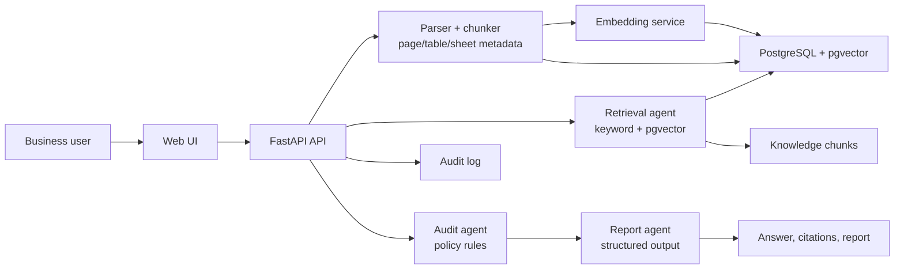

# Architecture

## Request flow

1. The user submits a question in the web UI.
2. Uploaded files are parsed into chunks with page, table, sheet, or line metadata.
3. The API retrieves the highest-scoring knowledge chunks.
4. The answer generator only selects sentences from retrieved evidence.
5. The audit rules detect sensitive data export, incident response, and legacy-policy conflicts.
6. The UI renders the answer, source excerpts, precise locations, and risk findings.
